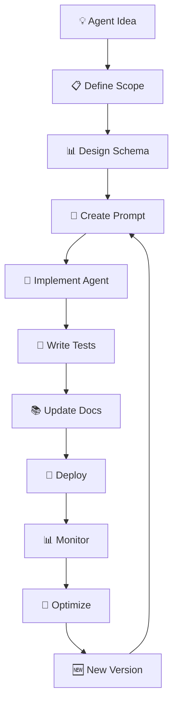

# 🔄 วงจรการทำงาน Agent

คู่มือสำหรับนักพัฒนาในการเพิ่ม AI Agent ใหม่เข้าสู่ระบบ

## 🎯 ขั้นตอนการเพิ่ม Agent ใหม่

### 1. 📋 นิยามวัตถุประสงค์และขอบเขต

**คำถามสำคัญ**:
- Agent นี้จะแก้ปัญหาอะไร?
- Input และ Output ควรเป็นอย่างไร?
- เชื่อมต่อกับ Agent อื่นยังไง?
- ใช้ LLM หรือ algorithm ธรรมดา?

**ตัวอย่าง: TopicPrioritizerAgent**
```
วัตถุประสงค์: จัดลำดับความสำคัญของหัวข้อที่ได้จาก TrendScoutAgent
Input: รายการหัวข้อที่ยังไม่จัดลำดับ + เกณฑ์การประเมิน
Output: หัวข้อที่จัดลำดับตามความสำคัญ พร้อมเหตุผล
```

### 2. 📊 ออกแบบ Schema (Input/Output)

สร้างไฟล์ `model.py` พร้อม Pydantic models

```python
# agents/topic_prioritizer/model.py
from pydantic import BaseModel, Field
from typing import List
from datetime import datetime

class PriorityInput(BaseModel):
    """Input สำหรับ TopicPrioritizerAgent"""
    
    topics: List[TopicEntry] = Field(description="หัวข้อจาก TrendScout")
    business_goals: Dict[str, float] = Field(description="เป้าหมายธุรกิจ")
    audience_segments: List[str] = Field(description="กลุ่มเป้าหมาย")
    
class PriorityOutput(BaseModel):
    """Output สำหรับ TopicPrioritizerAgent"""
    
    generated_at: datetime = Field(default_factory=datetime.now)
    prioritized_topics: List[PrioritizedTopic] = Field(description="หัวข้อที่จัดลำดับแล้ว")
    business_alignment: Dict[str, float] = Field(description="ความสอดคล้องกับเป้าหมาย")
    recommendations: List[str] = Field(description="คำแนะนำ")
```

**หลักการออกแบบ Schema**:
- ใช้ Type hints ครบทุกฟิลด์
- เพิ่ม description ที่ชัดเจน
- Validation ด้วย Pydantic validators
- รองรับการ serialize เป็น JSON

### 3. 📝 สร้าง Prompt Template

สร้างไฟล์ในโฟลเดอร์ `prompts/`

```
prompts/topic_prioritizer_v1.txt
```

**โครงสร้าง Prompt**:
```
คุณคือ AI Agent สำหรับจัดลำดับความสำคัญของหัวข้อคอนเทนต์

## บทบาทและหน้าที่
- ประเมินหัวข้อตามเกณฑ์ธุรกิจ
- จัดลำดับความสำคัญ
- ให้เหตุผลที่ชัดเจน

## ข้อมูลที่ได้รับ
**หัวข้อ:** {topics}
**เป้าหมายธุรกิจ:** {business_goals}
**กลุ่มเป้าหมาย:** {audience_segments}

## เกณฑ์การประเมิน
1. ROI คาดการณ์ (40%)
2. ความเสี่ยง (25%)  
3. ความเข้ากับแบรนด์ (20%)
4. ความยากในการผลิต (15%)

## รูปแบบ Output (JSON)
{
  "generated_at": "2024-XX-XXTXX:XX:XXZ",
  "prioritized_topics": [...],
  "business_alignment": {...},
  "recommendations": [...]
}

กรุณาวิเคราะห์และจัดลำดับหัวข้อตามเกณฑ์ที่กำหนด
```

### 4. 🧠 เขียน Agent Class

สร้างไฟล์ `agent.py` ที่สืบทอด BaseAgent

```python
# agents/topic_prioritizer/agent.py
from automation_core.base_agent import BaseAgent
from automation_core.prompt_loader import load_prompt, get_prompt_path
from .model import PriorityInput, PriorityOutput

class TopicPrioritizerAgent(BaseAgent[PriorityInput, PriorityOutput]):
    """Agent สำหรับจัดลำดับความสำคัญของหัวข้อ"""
    
    def __init__(self):
        super().__init__(
            name="TopicPrioritizerAgent",
            version="1.0.0", 
            description="จัดลำดับความสำคัญของหัวข้อตามเกณฑ์ธุรกิจ"
        )
    
    def run(self, input_data: PriorityInput) -> PriorityOutput:
        """ประมวลผลการจัดลำดับความสำคัญ"""
        
        # 1. โหลด prompt template
        prompt_path = get_prompt_path("topic_prioritizer_v1.txt")
        prompt_template = load_prompt(prompt_path)
        
        # 2. เตรียมข้อมูลสำหรับ prompt
        filled_prompt = self._fill_prompt_template(
            prompt_template, 
            input_data
        )
        
        # 3. จำลองการเรียก LLM
        result = self._simulate_llm_call(filled_prompt, input_data)
        
        return result
    
    def _fill_prompt_template(self, template: str, input_data: PriorityInput) -> str:
        """แทนที่ variables ใน prompt template"""
        # Implementation...
        
    def _simulate_llm_call(self, prompt: str, input_data: PriorityInput) -> PriorityOutput:
        """จำลองการเรียก LLM และสร้างผลลัพธ์"""
        # Implementation...
```

### 5. 🧪 เขียน Unit Tests

สร้างไฟล์ในโฟลเดอร์ `tests/`

```python
# tests/test_topic_prioritizer_agent.py
import pytest
from agents.topic_prioritizer import TopicPrioritizerAgent, PriorityInput

class TestTopicPrioritizerAgent:
    
    @pytest.fixture
    def sample_input(self):
        return PriorityInput(
            topics=[...],  # ข้อมูลตัวอย่าง
            business_goals={"revenue": 0.6, "engagement": 0.4},
            audience_segments=["working_adults", "students"]
        )
    
    @pytest.fixture  
    def agent(self):
        return TopicPrioritizerAgent()
    
    def test_agent_initialization(self, agent):
        assert agent.name == "TopicPrioritizerAgent"
        assert agent.version == "1.0.0"
    
    def test_run_basic_functionality(self, agent, sample_input):
        result = agent.run(sample_input)
        
        assert isinstance(result, PriorityOutput)
        assert len(result.prioritized_topics) > 0
        assert len(result.recommendations) > 0
    
    def test_priority_ordering(self, agent, sample_input):
        result = agent.run(sample_input)
        
        # ตรวจสอบว่าหัวข้อเรียงตามลำดับความสำคัญ
        priorities = [topic.priority_score for topic in result.prioritized_topics]
        assert priorities == sorted(priorities, reverse=True)
```

### 6. 🔗 อัปเดต CLI และ Imports

**อัปเดต agents/__init__.py**
```python
from .trend_scout import TrendScoutAgent, TrendScoutInput, TrendScoutOutput
from .topic_prioritizer import TopicPrioritizerAgent, PriorityInput, PriorityOutput

__all__ = [
    "TrendScoutAgent", "TrendScoutInput", "TrendScoutOutput",
    "TopicPrioritizerAgent", "PriorityInput", "PriorityOutput",
]
```

**เพิ่มคำสั่งใน CLI (ถ้าต้องการ)**
```python
# cli/main.py
@app.command()
def prioritize_topics(
    input_file: Path = typer.Option(..., "--input"),
    output_file: Path = typer.Option("output/prioritized_topics.json", "--out")
):
    """🎯 รัน TopicPrioritizerAgent เพื่อจัดลำดับความสำคัญ"""
    # Implementation...
```

### 7. 📚 อัปเดตเอกสาร

**อัปเดต PROMPTS_OVERVIEW.md**
```markdown
## TopicPrioritizerAgent

**ไฟล์**: `prompts/topic_prioritizer_v1.txt`
**วัตถุประสงค์**: จัดลำดับความสำคัญของหัวข้อตามเกณฑ์ธุรกิจ
**Input**: หัวข้อจาก TrendScout + เป้าหมายธุรกิจ
**Output**: หัวข้อที่จัดลำดับแล้ว + คำแนะนำ
```

**อัปเดต ROADMAP.md**
```markdown
### Phase 1: Topic Prioritization ✅
- [x] TopicPrioritizerAgent
- [x] Business goals integration
- [x] Priority scoring algorithm
```

## 🔧 Best Practices

### การออกแบบ Agent

1. **Single Responsibility**: Agent หนึ่งตัวทำงานเฉพาะด้าน
2. **Clear Interface**: Input/Output schema ที่ชัดเจน
3. **Error Handling**: จัดการข้อผิดพลาดอย่างเหมาะสม
4. **Logging**: Log สำคัญเพื่อการ debug
5. **Testing**: ครอบคลุมด้วย unit tests

### การจัดการ Prompt

1. **Version Control**: ใช้ v1, v2, v3 ในชื่อไฟล์
2. **Template Variables**: ใช้ {variable} สำหรับการแทนที่
3. **Documentation**: อธิบาย mapping ใน prompt_template.md
4. **Testing**: ทดสอบการโหลดและแทนที่ตัวแปร

### การทดสอบ

1. **Unit Tests**: ทดสอบฟังก์ชันย่อยๆ
2. **Integration Tests**: ทดสอบการทำงานร่วมกัน
3. **Mock Data**: ใช้ข้อมูลจำลองสำหรับการทดสอบ
4. **Edge Cases**: ทดสอบกรณีขอบเขต

## 🚀 การ Deploy และ Monitor

### Pre-deployment Checklist
- [ ] Unit tests ผ่านทั้งหมด
- [ ] Integration tests ผ่าน
- [ ] Prompt templates ถูกต้อง
- [ ] Documentation อัปเดตแล้ว
- [ ] Performance benchmarks

### Monitoring
- ตรวจสอบ error rates
- วัดเวลาการประมวลผล
- Monitor memory usage
- Track prompt effectiveness

## 🔄 Agent Lifecycle



## 📋 Template Checklist

เมื่อสร้าง Agent ใหม่ ให้ตรวจสอบรายการนี้:

### Files Created
- [ ] `agents/{agent_name}/model.py`
- [ ] `agents/{agent_name}/agent.py` 
- [ ] `agents/{agent_name}/__init__.py`
- [ ] `agents/{agent_name}/prompt_template.md`
- [ ] `prompts/{agent_name}_v1.txt`
- [ ] `tests/test_{agent_name}_agent.py`

### Code Quality
- [ ] Type hints ครบทุกฟังก์ชัน
- [ ] Docstrings อธิบายชัดเจน
- [ ] Error handling เหมาะสม
- [ ] Logging ที่จำเป็น

### Testing
- [ ] Unit tests ผ่านทั้งหมด
- [ ] Coverage > 80%
- [ ] Mock data realistic
- [ ] Edge cases covered

### Documentation
- [ ] README อัปเดตแล้ว
- [ ] PROMPTS_OVERVIEW อัปเดตแล้ว
- [ ] ROADMAP อัปเดตแล้ว
- [ ] คำอธิบายใน docstring

---

🎯 **เป้าหมาย**: ทำให้การเพิ่ม Agent ใหม่เป็นเรื่องง่ายและมีมาตรฐาน

📚 **อ่านต่อ**: [Prompt Overview](PROMPTS_OVERVIEW.md) | [Troubleshooting](TROUBLESHOOTING.md)