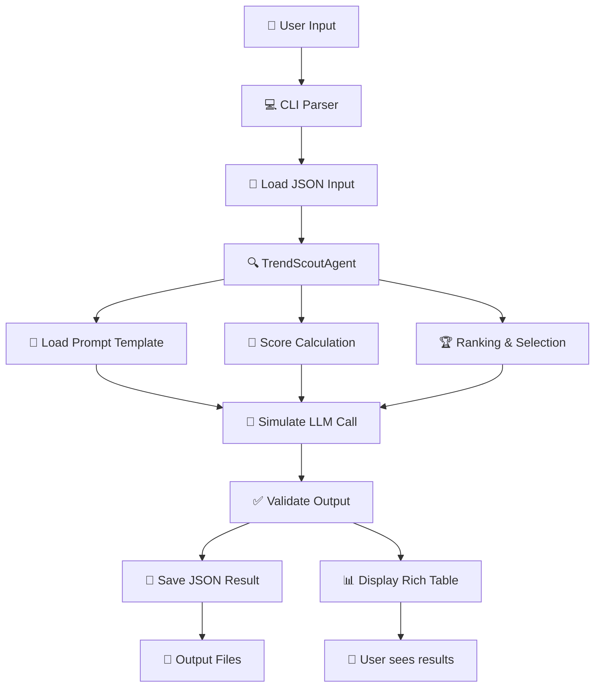

# 🏗️ สถาปัตยกรรมระบบ

เอกสารนี้อธิบายสถาปัตยกรรมของระบบ Dhamma Automation และการออกแบบโครงสร้างโค้ด

## 📊 แผนภาพระบบ (System Architecture)

```
┌─────────────────────────────────────────────────────────────────┐
│                    🎯 PRESENTATION LAYER                        │
├─────────────────────────────────────────────────────────────────┤
│  💻 CLI Interface (Typer)    │  🌐 Web API (FastAPI - Future)  │
│  - trend-scout command       │  - REST endpoints               │
│  - Rich table output         │  - Async processing             │
│  - Progress indicators       │  - WebSocket updates            │
└─────────────────────────────────────────────────────────────────┘
                                    │
                                    ▼
┌─────────────────────────────────────────────────────────────────┐
│                      🤖 AGENTS LAYER                           │
├─────────────────────────────────────────────────────────────────┤
│  TrendScoutAgent     │  TopicPrioritizer    │  OutlineAgent    │
│  - เทรนด์วิเคราะห์    │  - จัดลำดับหัวข้อ      │  - สร้างโครงเรื่อง │
│  - สร้างหัวข้อ        │  - ประเมินคุณภาพ       │  - โครงสร้างเนื้อหา │
│                      │                      │                  │
│  RetrievalAgent     │  ScriptWriter        │  ValidatorAgent  │
│  - ค้นหาข้อมูล        │  - เขียนสคริปต์        │  - ตรวจสอบคุณภาพ │
│  - รวบรวมเนื้อหา      │  - ปรับภาษา           │  - แนะนำปรับปรุง  │
└─────────────────────────────────────────────────────────────────┘
                                    │
                                    ▼
┌─────────────────────────────────────────────────────────────────┐
│                    ⚙️ AUTOMATION CORE                          │
├─────────────────────────────────────────────────────────────────┤
│  BaseAgent          │  Config              │  Logging         │
│  - Abstract class   │  - Environment vars  │  - Rich console  │
│  - Generic types    │  - Pydantic settings │  - File rotation │
│                     │                      │                  │
│  PromptLoader       │  Utils               │  Error Handling  │
│  - Template loading │  - Scoring functions │  - Custom exceptions │
│  - Path resolution  │  - Text processing   │  - Graceful failure │
└─────────────────────────────────────────────────────────────────┘
                                    │
                                    ▼
┌─────────────────────────────────────────────────────────────────┐
│                    📝 PROMPTS & DATA                           │
├─────────────────────────────────────────────────────────────────┤
│  Prompt Templates   │  Mock Data           │  Output Files    │
│  - trend_scout_v1   │  - mock_input.json   │  - JSON results  │
│  - topic_prioritizer│  - sample responses  │  - Cached data   │
│  - outline_v1       │  - test fixtures     │  - Logs          │
└─────────────────────────────────────────────────────────────────┘
                                    │
                                    ▼
┌─────────────────────────────────────────────────────────────────┐
│                   🔌 EXTERNAL INTEGRATIONS                     │
├─────────────────────────────────────────────────────────────────┤
│  LLM Services       │  Data Sources        │  Storage         │
│  - OpenAI GPT       │  - YouTube Data API  │  - File system   │
│  - Anthropic Claude │  - Google Trends     │  - SQLite (future)│
│  - Local models     │  - Competitor data   │  - Cloud storage │
└─────────────────────────────────────────────────────────────────┘
```

## 🧩 หลักการออกแบบ

### 1. Separation of Concerns (แยกความรับผิดชอบ)

**Presentation Layer**: จัดการการแสดงผลและการรับ input
- CLI commands และ argument parsing
- การแสดงผลด้วย Rich tables และ progress bars
- การจัดการ errors และ user feedback

**Agents Layer**: ประมวลผลธุรกิจหลัก
- แต่ละ Agent มีหน้าที่เฉพาะด้าน
- ใช้ BaseAgent เป็น interface มาตรฐาน
- Generic types สำหรับ type safety

**Core Layer**: ฟังก์ชันพื้นฐานและ utilities
- Configuration management
- Logging และ error handling
- ฟังก์ชันช่วยเหลือทั่วไป

### 2. Plugin Architecture (สถาปัตยกรรมแบบ Plugin)

```python
# แต่ละ Agent เป็น plugin ที่สามารถเพิ่มได้อิสระ
class BaseAgent(ABC, Generic[InputModel, OutputModel]):
    @abstractmethod
    def run(self, input_data: InputModel) -> OutputModel:
        pass

# การใช้งาน
agent = TrendScoutAgent()
result = agent.run(input_data)
```

### 3. External Prompt Management

```
📝 prompts/
├── trend_scout_v1.txt          # เวอร์ชัน 1
├── trend_scout_v2.txt          # เวอร์ชัน 2 (อนาคต)
├── topic_prioritizer_v1.txt
└── outline_agent_v1.txt
```

**ข้อดี**:
- แก้ไข prompt ได้โดยไม่ต้องแก้โค้ด
- Version control สำหรับ prompt
- ง่ายต่อการทดสอบ A/B testing

## 🔄 Data Flow (การไหลของข้อมูล)



### ขั้นตอนการประมวลผล

1. **Input Parsing**: แปลง JSON เป็น Pydantic models
2. **Agent Execution**: รัน Agent ตาม business logic
3. **Prompt Loading**: โหลด template จากไฟล์ภายนอก
4. **Mock LLM Simulation**: จำลองการเรียก LLM ด้วยอัลกอริทึม
5. **Output Validation**: ตรวจสอบ schema และข้อมูล
6. **Result Presentation**: แสดงผลด้วย Rich และบันทึกไฟล์

## 🏛️ โมดูลหลักและหน้าที่

### automation_core/

**base_agent.py**
```python
class BaseAgent(ABC, Generic[InputModel, OutputModel]):
    """คลาสพื้นฐานสำหรับ AI Agents ทั้งหมด"""
    
    def __init__(self, name: str, version: str, description: str)
    
    @abstractmethod
    def run(self, input_data: InputModel) -> OutputModel
```

**config.py**
```python
class AppConfig(BaseSettings):
    """การตั้งค่าแอปพลิเคชันด้วย Pydantic"""
    
    app_name: str = "dhamma-automation"
    log_level: str = "INFO"
    # โหลดจาก .env file อัตโนมัติ
```

**prompt_loader.py**
```python
def load_prompt(path: str) -> str:
    """โหลด prompt template จากไฟล์"""
    
def get_prompt_path(prompt_name: str) -> Path:
    """หา path ของ prompt file"""
```

### agents/trend_scout/

**model.py**: Pydantic models สำหรับ Input/Output
- `TrendScoutInput`: ข้อมูลนำเข้า
- `TrendScoutOutput`: ผลลัพธ์
- `TopicEntry`: รายการหัวข้อแต่ละตัว

**agent.py**: ตัว Agent หลัก
- อัลกอริทึมการสร้างหัวข้อ
- การคำนวณคะแนนแต่ละมิติ
- การจัดอันดับและคัดเลือก

## 🔧 Configuration Management

### Environment Variables
```bash
# .env file
APP_NAME="dhamma-automation"
LOG_LEVEL="INFO"
DATA_DIR="./data"

# API Keys (สำหรับอนาคต)
OPENAI_API_KEY="sk-..."
YOUTUBE_API_KEY="AIza..."
```

### Pydantic Settings
```python
# อ่านจาก environment variables และ .env file อัตโนมัติ
config = AppConfig()
print(config.app_name)  # "dhamma-automation"
print(config.log_level)  # "INFO"
```

## 🧪 Testing Strategy

### Unit Tests
- **test_trend_scout_agent.py**: ทดสอบ Agent behavior
- **test_prompt_loading.py**: ทดสอบการโหลด prompt
- **test_scoring_utils.py**: ทดสอบการคำนวณคะแนน

### Integration Tests
- ทดสอบการทำงานร่วมกันของโมดูลต่างๆ
- ทดสอบกับข้อมูล mock จริง
- ทดสอบ CLI commands

### Test Data
```
tests/
├── fixtures/           # ข้อมูลทดสอบ
├── test_*.py          # Test cases
└── conftest.py        # Pytest configuration
```

## 🚀 Scalability Considerations

### การเพิ่ม Agent ใหม่
1. สร้างโฟลเดอร์ใน `agents/`
2. สร้าง `model.py` กับ Input/Output schemas
3. สร้าง `agent.py` ที่สืบทอด BaseAgent
4. เพิ่ม prompt template ใน `prompts/`
5. เขียน tests

### การปรับขนาด (Scaling)
- **Horizontal**: เพิ่มเครื่อง/container สำหรับ Agent แต่ละตัว
- **Vertical**: ปรับแต่งประสิทธิภาพ algorithm
- **Caching**: เก็บผลลัพธ์ที่ใช้บ่อยใน cache
- **Queue System**: ใช้ Celery/RQ สำหรับงานที่ใช้เวลานาน

## 🔐 Security & Privacy

### Prompt Security
- Prompt templates แยกออกจากโค้ด
- ไม่ hardcode sensitive data
- Version control สำหรับ prompt changes

### API Key Management
- ใช้ environment variables
- ไม่ commit keys ลง git
- Rotation และ monitoring

### Data Privacy
- ไม่เก็บข้อมูลส่วนบุคคล
- Log masking สำหรับข้อมูลสำคัญ
- Compliance กับ PDPA (ถ้าจำเป็น)

---

📚 **อ่านต่อ**: [วงจรการทำงาน Agent](AGENT_LIFECYCLE.md) | [Prompt Overview](PROMPTS_OVERVIEW.md)